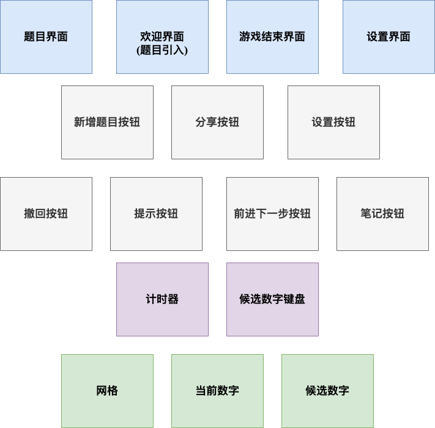
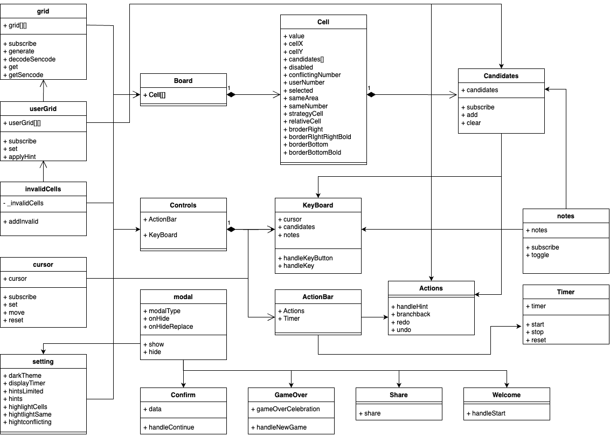

## 愿景

### 概述
数独是一种风靡全球，历史悠久的游戏。在人们的一般印象中，数独一般与难度高，难入门挂钩，从而令想尝试它的人望而却步。我们旨在设一款对于玩家数独经验没有要求的数独游戏，让任何人都可以在数独游戏中获得乐趣。

### 用户群体
对数独游戏有兴趣的人群。

### 用户需求
- 可玩性：对于初学者，需要游戏提供了`Very Easy`和`Easy`难度的题目，这部分题目的难度较小，易于初学者上手。另外，需要游戏提供了提示功能，利用已有的算法帮助玩家在一些空中做出选择，进一步降低了题目的难度。
- 趣味性：对于有一定基础以及较为资深的玩家，需要游戏提供了`Medium`，`Hard`难度的题目，并且增设了计时器功能，令玩家可以相互比较解题的速度。
- 个性化：玩家可能希望自己导入特定的题目。
- 互动性：玩家可能希望分享自己当前所完成的题目。

### 产品愿景
本产品旨在创建一款可玩性高的数独游戏，其对玩家的数独基础没有要求，无论是初学者还是经验丰富的玩家都可以从中获得乐趣。另外，游戏配备了分享功能，让玩家与玩家间可以共享同一个数独题目，为协作解题与竞赛解题成为可能。
### 核心价值
- 可玩性：让任何数独经验的用户都可以从中获得乐趣。
- 趣味性：让玩家可以在解题的过程中感受到竞赛的趣味。
- 个性化：允许玩家对自己感兴趣的题目进行求解。
- 互动性：玩家与玩家之间可以就同一道题目展开互动。

## 用例分析
```yaml
Name: 数独问题加载
Identifier: SUDOKO 1
Description: 
	- 系统能够从用户提供的`url`中加载数独问题，并在界面上显示初始状态。
	- 系统能够根据用户选定的题目难度创建题目。
Preconditions:
Postconditions:
	- 如果加载成功，相应的题目需加入到题目列表中，当前界面显示题目信息且计时器启动
	- 如果加载失败，提供相应的报错信息，返回新增题目界面。
Basic Action:
	1. 用户点击主界面的新增按钮:RiAddCircleFill:，进入新增题目页面。
	2. 随后点击新增题目页面右上角的:RiAddCircleLine:，在其中填入目标题目的url。
	3. 系统判定该url是否合法，若不合法跳转到异常处理A。
	4. 系统完成数独问题解析，如解析失败跳转到异常处理B。
	5. 系统在屏幕中显示游戏的初始状态，用户可以对该题目进行命名，默认题目设置为用户提供`url`的文件名。后缀为`.suduko`。
异常处理A: 输入url不合法
	A.4:
		- 如果该url对应页面不存在或者访问超时，输出弹框:LiAppWindow:显示信息无法访问`$url`。
		- 如果可以访问url， 但是不存在数独题目的信息，输出弹框:LiAppWindow:显示`数独题目不存在`。
	A.5: 用户查看报错信息，并关闭弹窗。
	A.6: 系统返回新增题目界面。
异常处理B: 数独问题解析失败
	B.4:
		- 如果输入数独题目的大小不合法，`GRID_SIZE !== BOX_SIZE**2 || GRID_SIZE > MAX_GRID_SIZE || BOX_SIZE > MAX_BOX_SIZE || GRID_SIZE < 0 || BOX_SIZE < 0` ，则在报错弹框:LiAppWindow:中输出相关情况。
		- 如果输入数独题目的固定数字不合法，即超过`GRID_SIZE`，则在报错弹框:LiAppWindow:中输出相关情况。
	B.5: 用户查看报错信息，并关闭弹窗。
	B.6: 系统返回新增题目界面。
```


```yaml
Name: 计时功能
Identifier: SUDOKO 2
Description: 
	-  系统会记录用户对当前题目的作答时间，此处记录的时间为累积作答时间，最小单位为秒。
Preconditions:
	- 用户正在进行当前数独游戏的求解。
Postconditions:
	- 用户成功求解问题，如果当前解题时间小于历史最短解题时间，则更新历史最短解题时间，并刷新排行榜。
	- 用户求解问题过程中断，保存当前答题状态。
	- 用户重置问题，并重置已填充的空格。
Basic Action:
	1. 用户进入游戏界面或者新增题目成功后自动跳转到游戏界面。
	2. 系统读取计时器的当前值，如果为新增题目则从零开始计数，否则从当前计数值开始计数。
	3. 系统启动计时器，开始计时。
	4.
		- 如果用户完成了当前题目的求解，跳转到SUCCESS。
		- 如果用户中断了当前题目的求解，跳转到INTERRUPT。
		- 如果用户重置了当前题目，跳转到RESET。
SUCCESS:
	SUCCESS.5: 系统停止计时并记录当前作答时间。
INTERRUPT:
	INTERRUPT.5: 系统中断计时器。
RESET:
	RESET.5: 系统重置计时器为0。
```

```yaml
Name: 操作撤回功能
Identifier: SUDOKO 3
Description: 
	-  用户可以对已经操作的某个原本为空白的网格进行操作重置，即重新将其置为空格。
Preconditions:
	- 用户正在进行当前数独游戏的求解。
Postconditions:
	- 系统更新提示信息。
Basic Action:
	1. 用户利用选择目标网格功能选择特定网格。
	2. 用户点击撤回按钮
	3. 系统重置选中网格的数据为空。
```

```yaml
Name: 选择目标网格功能
Identifier: SUDOKO 4
Description: 
	-  用户可以选择某一个原本为空白的网格进行特定的操作。
Preconditions:
	- 用户正在进行当前数独游戏的求解。
Basic Action:
	1. 用户点击某个网格，如果该网格不可选中，则跳转到`Basic Action`。
	2. 系统界面下方自动显示该空格可被填入的数字以及确认按钮，并将选中的网格用蓝色方框包围。
```

```yaml
Name: 填入候选数字功能
Identifier: SUDOKO 5
Description: 
	-  用户可以选择某一个原本为空白的网格进行特定的操作。
Preconditions:
	- 用户正在进行当前数独游戏的求解。
Basic Action:
	1. 用户利用选择目标网格功能选择特定网格。
	2. 
		 - 用户随后点击候选数字的某个数值。
		 - 用户直接点击提交按钮，跳转到异常处理A。
	3. 系统填出选中的数字到空格中。
异常处理A:
	- A.3 跳转到第2步。
```

```yaml
Name: 提示功能
Identifier: SUDOKO 6
Description: 
	-  用户可以点击获取当前题目的提示信息。提示信息显示为每个仍未进行填充方格可选的候选值。
Preconditions:
	- 用户正在进行当前数独游戏的求解。
Basic Action:
	1. 用户点击提示按钮。
	2. 系统将每个仍未进行填充方格填充候选值并显示为绿色。
```

```yaml
Name: 分享功能
Identifier: SUDOKO 6
Description: 
	-  用户可以在点击分享按钮将当前所做的题目分享到特定的社交平台。
Preconditions:
	- 用户正在进行当前数独游戏的求解。
Postconditions:
	- 用户选定指定的方式接受到题目邀请。
Basic Action:
	1. 用户点击分享按钮。
	2. 系统列出可选择的分享方式
	3. 用户在其中选择其中一种。
	4. 系统将该题目分享到对应的平台。
```

## 领域模型

## 技术架构

1. 前端 (frontend)
- **技术栈**：svelte，HTML，CSS，JavaScript
- **描述**：Svelte 是一个现代的前端框架，利用编译时技术将组件转换为高效的原生 JavaScript 代码。HTML、CSS 和 JavaScript 用于构建界面和交互。

2. 状态管理（State Management）:
- **技术**：Svelte Store
- **描述**：Svelte Store 用于全局状态管理，帮助在组件之间共享状态。

3. 路由管理（Routing）:
- **技术**：Svelte Routing Library（如 `svelte-routing` 或 `svelte-spa-router`）
- **描述**：用于管理前端路由，实现页面之间的导航和 URL 路由。

4. HTTP 请求处理（HTTP Requests）:
- **技术**：Node.js
- **描述**：用于处理前端发送的http请求，并返回特定的文件与结果。

5. 样式（Styling）:
- **技术**：CSS、TailwindCSS
- **描述**：用于定义样式和布局。

6. 构建工具（Build Tools）:
- **技术**：Rollup
- **描述**：Rollup 用于打包、优化和构建前端项目。
## 对象模型



## 设计改进建议

### 功能单元划分
- [ ] `invalidCells`实际上可以集成在`userGrid`中实现。
- [ ] `candidate`应该与`userGrid`相关。

### 下一步提示
**Description**: 在当前的项目中，下一步提示的功能直接由数独游戏的正确答案给出，玩家无法得知可以由什么样的策略得到提示空格的结果。因此，我们需要重构这部分的代码，使用特定的策略对其可以应用的空格进行候选值的缩减。当用户点击经由提示得出的网格数值/候选值时，应用需要将与应用于该网格上的策略所使用到的网格标识出来，并利用文字描述使用的策略。

**Function Request**:

- [ ]  单个策略可以识别当前数独游戏中可以应用的网格，并在当前的状态空间中存储其应用于该网格所使用的信息，最终正确地缩减应用网格的候选值。
- [ ]  多个策略间的执行不会相互影响且可以级联地应用于同一网格中，缩减其候选值。
- [ ]  如果策略组执行一轮策略后可以得到单个候选值的网格，则将单个候选值的网格状态置为该候选值。同时不将仍有多个候选值的网格显示，且不改变缩减了候选值但是候选值数量不为1的网格的状态。
- [ ]  玩家可以设置n, 使仍有至多n个候选值的网格在当前数独中显示其候选值，当该轮提示后存在网格候选值数量不为1时，玩家可以选择其中该网格其中一个候选值作为其待定值继续进行游戏。

**Reference**  
策略实现参考：[sudoku策略](https://www.sudokuwiki.org/Sudoku.htm)  
设计模式: [策略模式](https://refactoringguru.cn/design-patterns/strategy)

### 探索回溯功能
**Description**: 由下一步提示功能([#1](https://github.com/chenjh2002/sudoku/issues/1))我们可知，用户可以选择某一个候选值继续进行游戏。如果在后续游戏中，发现先前所选择的值不正确，我们希望系统可以提供一个选项，让用户可以直接将数独游戏的状态重新置为选择候选值的状态，从而降低深度探索的代价。

**Function Request**:

- [ ]  系统支持多步回溯功能，用户可以回到多步前的分支节点，系统所设计的数据结构可以完整的存储当时时间步的状态。
- [ ]  系统对于距离当前时间步最近的那次分支已经探索过的候选值进行过滤，在每一次回溯时取出当次探索所使用的候选值，降低用户的记忆成本。

**Reference**  
设计模式: [状态模式](https://refactoringguru.cn/design-patterns/state)

### 资源集成功能
**Description**:在下一步提示功能([#1](https://github.com/chenjh2002/sudoku/issues/1))中，每一个数独策略都需要满足一定的条件才能应用于特定的网格中。为了验证新增策略是否正确，我们需要引入可以应用该策略的数独游戏，并验证该策略是否可以正确的运用于正确的网格中。

**Function Request**:

- [ ]  系统可以从[sudokuwiki](https://www.sudokuwiki.org/Sudoku.htm)中导入可以应用新增策略的数独题目。

**Reference**:  
数独游戏题目集: [sudokuwiki](https://www.sudokuwiki.org/Sudoku.htm)
