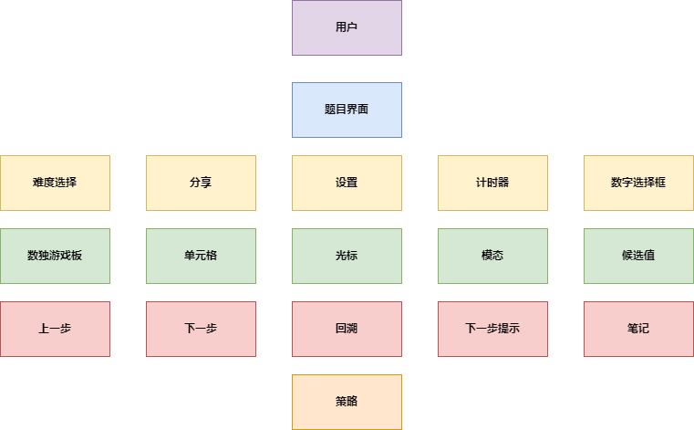

# 数独乐乐小组逆向分析
## 概述
 
本Markdown文档旨在详细阐述“数独乐乐”数独游戏的核心功能及其交互行为。游戏界面包含难度选择、设置、分享、数独游戏板、计时器、回溯功能、步骤导航（回到上一步、下一步）、提示系统以及笔记功能。
 
## 用例分析
 
### 1. 难度选择
 
- **参与者**：玩家
- **前置条件**：游戏已启动，玩家处于主界面或游戏进行中
- **事件流**
  1. 玩家点击“难度选择”按钮。
  2. 系统显示难度选项（非常简单、简单、中等、困难）。
  3. 玩家选择难度。
  4. 系统加载相应难度的数独游戏板。
- **后置条件**：游戏板根据所选难度初始化。
 
### 2. 设置
 
- **参与者**：玩家
- **前置条件**：游戏已启动，玩家处于主界面或游戏进行中
- **事件流**
  1. 玩家点击“设置”按钮。
  2. 系统显示设置选项（提示数量、高亮选项等）。
  3. 玩家调整设置。
  4. 玩家保存设置或返回主界面。
- **后置条件**：游戏设置根据玩家调整进行更新。
 
### 3. 分享
 
- **参与者**：玩家
- **前置条件**：游戏已启动，玩家处于游戏完成或任意进度状态
- **事件流**
  1. 玩家点击“分享”按钮。
  2. 系统显示分享选项（如链接、社交媒体、邮件等）。
  3. 玩家选择分享方式并发送。
- **后置条件**：游戏进度或完成状态被分享至指定平台。
 
### 4. 数独游戏板
 
- **参与者**：玩家
- **前置条件**：游戏已启动，难度已选择
- **事件流**
  1. 玩家在数独游戏板上输入数字。
  2. 系统验证输入是否正确。
  3. 若正确，游戏板更新；若错误，提示错误并允许玩家回溯或回到上一步继续尝试。
- **后置条件**：游戏板状态根据玩家输入进行更新。
 
### 5. 计时器
 
- **参与者**：玩家
- **前置条件**：游戏已启动，玩家开始游戏
- **事件流**
  1. 计时器自动开始计时。
  2. 玩家在游戏进行中可随时查看时间。
  3. 游戏完成时，计时器停止并记录总时间。
- **后置条件**：玩家获得游戏完成时间的记录。
 
### 6. 回溯
 
- **参与者**：玩家
- **前置条件**：游戏进行中，玩家输入错误导致游戏无法继续
- **事件流**
  1. 玩家点击“回溯”按钮。
  2. 系统将游戏板状态恢复到上一次正确输入的状态。
- **后置条件**：游戏板状态回退到上一次正确输入点。
 
### 7. 步骤导航（回到上一步、下一步）
 
- **参与者**：玩家
- **前置条件**：游戏进行中，玩家已进行多次输入
- **事件流**
  1. 玩家点击“回到上一步”按钮，游戏板状态回退到上一步。
  2. 玩家点击“下一步”按钮（若存在已保存的步骤），游戏板状态前进到下一步。
- **后置条件**：游戏板状态根据玩家操作进行相应回退或前进。
 
### 8. 提示系统（下一步提示）
 
- **参与者**：玩家
- **前置条件**：游戏进行中，玩家需要提示以继续游戏
- **事件流**
  1. 玩家点击“下一步提示”按钮。
  2. 系统给出下一步的正确数字及导致该提示的数独策略和相关单元格。
- **后置条件**：玩家获得下一步的正确数字及策略解析。
 
### 9. 笔记功能
 
- **参与者**：玩家
- **前置条件**：游戏进行中，玩家需要在单元格中记录候选值
- **事件流**
  1. 玩家点击游戏板上的单元格。
  2. 系统显示候选值输入框。
  3. 玩家输入候选值并保存。
  4. 玩家可随时查看或清除候选值。
- **后置条件**：游戏板上的单元格记录了玩家输入的候选值。

## 领域模型



## 设计原则
### 1. 单一职责原则（Single Responsibility Principle, SRP）
每个类应该只有一个引起它变化的原因。换言之，一个类应该只负责一项功能。例如，在我们的数独项目中，```Grid``` 类负责整个游戏网格的状态管理，包括初始化、更新和验证单元格的值。它作为所有 ```Cell``` 对象的容器，提供了对整个游戏逻辑和规则检查的支持。另一方面，```Cell``` 类则专注于处理单个单元格的信息和逻辑，如维护可能的数值列表、确定是否为初始给定的常数值以及应用解题策略。这种分离使得当我们需要调整单元格的行为或网格的整体管理时，可以独立地进行修改，而不会影响到其他部分。

### 2. 开闭原则（Open/Closed Principle, OCP）
软件实体（如类、模块、函数等）应该对扩展开放，对修改关闭。这意味着我们可以在不修改现有代码的情况下增加新的功能。我们的项目遵循开闭原则，这体现在策略模块 ```Strategy``` 的设计上。每当有新的解题策略被引入，我们不需要更改现有的代码来支持这个新特性。相反，我们可以通过创建一个新的策略类并将其添加到 ```Strategy``` 模块中来实现扩展。比如，当团队想要增加一个高级的数独解题技巧时，他们只需编写该技巧对应的算法，并确保它可以被 ```Strategy``` 模块正确调用。这种方式不仅保持了现有代码库的稳定性，也方便了未来的功能扩展，而无需更改现有的 ```Cell``` 或 ```Grid``` 类的实现。

### 3. 里氏替换原则（Liskov Substitution Principle, LSP）
子类型必须能够替换它们的基类型而不影响程序的正确性。这确保了继承结构的健全性和可预测性。在项目中，我们确保子类型能够替代基类型使用，而不会破坏系统的正确性。例如，假设我们有一个基础的 ```BaseStrategy``` 类用于定义基本的解题方法，然后我们创建了一个或多个具体的策略类（如 ```NakedSingles```, ```HiddenSingles```），这些子类实现了特定的解题逻辑。当我们在游戏中使用这些策略时，无论是直接使用 ```BaseStrategy``` 还是其任何子类，都应该得到一致的结果。这样做的好处在于，即使以后添加了更多复杂的策略，只要它们继承自 ```BaseStrategy``` 并遵守同样的接口约定，那么它们就可以无缝地融入现有的解题框架中。

### 4. 接口隔离原则（Interface Segregation Principle, ISP）
客户端不应该依赖于它们不使用的接口。大而全的接口应该被拆分为更小的、具体的接口，以便客户端只需知道它们感兴趣的方法。为了满足ISP，我们设计了专门的接口供不同的组件使用。例如，在处理用户输入时，```Prompt.svelte``` 和 ```Dropdown.svelte``` 只依赖于它们真正需要的功能，而不是整个 ```@sudoku/game.js``` 或 ```@sudoku/stores/grid.js``` 提供的所有功能。通过这种方式，我们可以保证各个组件只与其关心的部分交互，避免不必要的耦合。对于 ```Cursor``` 来说，它仅需了解如何追踪当前选中的单元格位置，并提供导航功能，无需知晓其他不相关的细节。

### 5. 依赖倒置原则（Dependency Inversion Principle, DIP）
高层次模块不应该依赖低层次模块，两者都应该依赖于抽象；此外，抽象不应该依赖细节，细节应该依赖于抽象。这一原则有助于解耦系统组件。在我们的设计中，```Grid``` 和 ```Cell``` 等高层次模块通过依赖 ```Strategy``` 抽象接口与具体策略实现解耦，使得策略的改变不会直接影响到核心逻辑。

### 6. 迪米特法则（Law of Demeter, LoD），或最少知识原则
一个对象应该尽可能少地了解其他对象。这样可以减少对象之间的耦合度，使系统更加模块化。高层次模块如 ```Grid``` 和 ```Cell``` 依赖于抽象接口而非具体的实现。这意味着，```Grid``` 不直接操作具体的策略对象，而是通过策略接口与之交流。同样地，```Cell``` 类也不直接依赖于某个特定的策略实现，而是依赖于策略接口提供的服务。这样做不仅提高了系统的灵活性，还允许我们在不改变高层模块的情况下轻松替换底层的具体实现。例如，如果我们决定更换回溯机制的实现，只需要修改底层的时间步状态管理逻辑，而无需改动 ```Grid``` 或 ```Cell``` 的代码。

### 7. DRY 原则（Don't Repeat Yourself）
系统中的每个知识点应该有一个单一、明确、权威的表示。避免重复代码，提高复用性和维护性。在整个项目中，我们努力避免重复代码。例如，在资源集成部分，我们将数独题目的解码和验证逻辑集中放在 ```@sudoku/sencode/index.js``` 文件中。无论是在启动自定义游戏还是从网页解析题目时，都会调用同一个解码函数 ```decodeSencode(sencode)``` 和验证函数 ```validateSencode(sencode)```。这样做不仅减少了冗余代码的数量，也确保了逻辑的一致性和准确性，从而提高了系统的可靠性和易维护性。


## 设计模式
在我们的数独项目中，策略模式（Strategy Pattern）和对象模式（Object Pattern）是两个关键的设计模式，此外还有普通工厂模式（Simple Factory Pattern），它们帮助我们构建了一个灵活、可扩展且易于维护的系统。下面将具体讲解这两个设计模式是如何应用到项目中的。
### 1. 策略模式
策略模式是一种行为型设计模式，它允许在一个类中定义一系列算法，并让这些算法可以在运行时相互替换。这使得算法可以独立于使用它的客户端而变化。

**在项目中的应用**：
- **策略模块 ```Strategy``` 的设计：**
  在我们的项目中，策略模式被用来实现不同的数独解题技巧。每个具体的解题策略都被封装为一个独立的类或函数，这些策略共同构成了 ```Strategy``` 模块的一部分。例如，我们可以有 ```NakedSingles```, ```HiddenSingles```, ```PointingPairs``` 等多个策略类，每一个都实现了特定的解题逻辑。
- **多级提示功能：**
  当用户请求提示时，系统会按照预设的顺序调用不同的策略来生成提示信息。每次点击提示按钮后，系统会选择下一个更高级别的策略进行计算，直到找到合适的提示或者所有可用策略都被尝试过为止。这种机制不仅为用户提供了解决问题的不同路径，也提高了游戏的教育性和趣味性。
- **策略的动态选择：**
  用户可以选择自己偏好的解题策略，或者让系统自动根据当前局面选择最合适的策略。这通过将策略作为参数传递给需要它们的对象（如 ```Cell``` 或 ```Grid```），并在适当的时候调用这些策略的方法来实现。这样做的好处在于，即使未来添加了新的解题策略，也可以很容易地集成进来，而不需要修改现有代码。
- **策略与单元格的关系：**
  每个 ```Cell``` 都有一个 ```strategies``` 属性，用于存储适用于该单元格的一系列解题策略。当需要对某个单元格应用提示或回溯操作时，可以通过遍历其关联的策略列表，找到最适合当前情况的那个策略。这种方式确保了策略的选择是基于上下文的，从而提高了提示和回溯的准确性。

### 2. 对象模式
对象模式并不是一个严格意义上的设计模式，而是一种广义上的术语，指的是面向对象编程中的最佳实践，包括但不限于创建和管理对象的方式。在这个语境下，我们将讨论如何利用对象模式的原则来组织和优化代码结构。

**在项目中的应用**：
- **单一职责原则下的对象设计：**
  我们的项目遵循了单一职责原则，这意味着每个对象（如 ```Grid```, ```Cell```, ```Cursor```）都有明确的责任范围。```Grid``` 负责整体网格的状态管理；```Cell``` 关注单个单元格的信息和逻辑；```Cursor``` 则追踪选中的单元格位置并提供导航功能。这样的设计保证了每个对象都专注于解决特定的问题域，简化了系统的复杂度。
- **属性和方法的精确定义：**
  在定义对象时，我们仔细分析了每个类所需的属性和方法。例如，Cell 类除了包含其位置和当前值外，还知晓如何根据数独规则更新自身状态，以及维护可能的数值列表。这使得每个 Cell 实例都能够独立处理自己的逻辑，同时又可以与其他单元格协同工作，以保持整个数独网格的一致性和合法性。
- **高内聚低耦合的对象关系：**
  通过合理划分职责，我们确保了对象之间的耦合度较低，即一个对象的变化不会轻易影响到其他对象。比如，```Grid``` 和 ```Cell``` 之间的交互是通过清晰定义的接口完成的，而不是直接访问对方的内部属性或方法。这不仅提高了代码的可读性和可维护性，也为未来的扩展留下了空间。

### 3. 工厂模式
工厂模式是一种创建型设计模式，它提供了一种创建对象的最佳方式，通过定义一个用于创建对象的接口，但由子类决定实例化哪一个类。这样将对象的创建和使用分离，提高了代码的灵活性和可维护性。普通工厂模式（Simple Factory Pattern）是工厂模式的一种简化形式，通常不涉及复杂的继承结构或接口实现，而是直接在一个类中包含所有创建逻辑。

在我们的数独项目中，普通工厂模式主要用于创建时间步状态管理的对象以及初始化这些对象所需的属性。具体来说，我们用它来处理回溯功能中的链表节点创建。以下是该模式如何帮助我们优化代码的具体体现：

1. **简化对象创建过程**
   通过引入 ```CreateCellLinkedList``` 构造函数，我们可以简化链表节点的创建过程。每当需要记录一个新的时间步状态时，调用这个构造函数即可获得一个已经正确初始化的新节点对象。这种方式不仅减少了重复代码的数量，还使得新增加的时间步状态能够一致地被初始化。

2. **提高代码复用性和扩展性**
   普通工厂模式允许我们将对象创建的逻辑集中在一个地方，这不仅提高了代码的复用性，也方便了未来的扩展。例如，如果我们想要添加新的属性到每个时间步状态节点中，只需要修改 ```CreateCellLinkedList``` 函数，而不需要更改每次创建新节点的地方。此外，如果将来我们需要支持不同的数据结构来存储时间步状态，也可以很容易地调整工厂函数而不影响其他部分的代码。

3. **隐藏复杂的创建逻辑**
   对于外部用户而言，他们不需要关心具体的对象是如何被创建出来的，只需要知道调用某个方法就可以得到所需类型的对象。这种封装隐藏了内部细节，降低了使用门槛，并且保护了创建逻辑不受外界干扰。比如，在回溯功能中，当我们想要回到之前的一个时间步时，只需调用相关的方法，而不用了解底层链表是如何操作的。

4. **支持多态性**
   虽然普通工厂模式本身并不强制要求多态性，但在实际应用中，它确实有助于实现这一点。例如，如果未来我们决定根据不同情况创建不同类型的链表节点（如带有额外信息的时间步节点），那么可以在 ```CreateCellLinkedList``` 中加入条件判断，根据传入参数的不同返回相应的节点类型。这增加了系统的灵活性，同时也保持了接口的一致性。


策略模式、对象模式和普通工厂模式的应用使我们的数独项目既具有高度的灵活性和扩展性，又保证了代码的清晰性和可维护性。这两种模式相辅相成，为构建高质量的软件产品奠定了坚实的基础。


## 对象模型


## 系统技术架构

1. **前端**:
   - **技术栈**：Svelte，HTML，CSS，JavaScript
   - **描述**：Svelte 是一个现代的前端框架，通过编译时将组件转换为高效的原生 JavaScript 代码，避免了传统框架在浏览器中执行的虚拟 DOM diff 操作，从而提高了性能。HTML、CSS 和 JavaScript 共同作用，构建用户界面和交互逻辑。Svelte 的声明式语法使得组件的编写更加简洁和直观。

2. **状态管理**:
   - **技术**：Svelte Store
   - **描述**：Svelte Store 是 Svelte 提供的内建状态管理库，用于在应用的不同组件之间共享和同步状态。与传统的前端框架相比，Svelte 的状态管理更为简单和高效。通过使用 Store，状态的变化会自动反映到依赖该状态的所有组件，实现响应式数据流，使得应用更加灵活和可维护。

3. **路由管理**:
   - **技术**：Svelte Routing Library（如 `svelte-routing` 或 `svelte-spa-router`）
   - **描述**：用于处理单页应用（SPA）中的页面导航和路由管理。Svelte Routing Library 提供了简洁的 API 来管理页面之间的跳转，同时保持应用的状态和性能不受影响。通过使用这些库，开发者可以轻松实现动态页面加载和 URL 路由匹配，确保用户在不同的 URL 之间平滑过渡。

4. **HTTP 请求处理**:
   - **技术**：Node.js
   - **描述**：Node.js 用于处理前端发送的 HTTP 请求，作为后端服务的基础。Node.js 高效的非阻塞 I/O 模型使其特别适用于高并发的网络请求处理。前端通过 AJAX 或 Fetch API 向后端发送请求，后端通过 Node.js 处理请求并返回响应数据。Node.js 还可以与数据库进行交互，提供 API 服务或静态文件支持。

5. **样式**:
   - **技术**：CSS，TailwindCSS
   - **描述**：CSS 用于定义网页的样式和布局，包括字体、颜色、排版、响应式设计等。TailwindCSS 是一个实用的 CSS 框架，提供了大量的预定义类，用于快速构建响应式和自定义的用户界面。通过 TailwindCSS，开发者可以通过组合类来实现布局和设计，而不需要写大量的自定义 CSS。TailwindCSS 还支持按需加载，帮助优化应用的性能。

6. **构建工具**:
   - **技术**：Rollup
   - **描述**：Rollup 是一个 JavaScript 构建工具，特别适用于打包模块化代码。它提供了高效的代码拆分、Tree Shaking、插件系统等功能。通过 Rollup，开发者可以将多个 JavaScript 文件打包成一个优化后的单一文件，从而减少浏览器的加载时间。Rollup 也支持与 Svelte 等现代前端框架集成，帮助自动化构建和优化过程。


## 分工
| 学号       | 姓名  | 贡献率 |                                                   制品与贡献                                                    |
| -------- | --- | --- | :--------------------------------------------------------------------------------------------------------: |
| 24214372 | 陈俊皓 | 40% | 1. 下一步提示功能对象成员及方法设计与前端实现100%<br>2. 回溯功能对象成员及方法设计与前端实现100%<br>3. 数独游戏导入功能 100%<br>4. `hiddenSingle`策略实现100% |
| 24214498 | 宋瑞  | 20% |                         1. 数独乐乐报告第一部分 100%<br>2. `pointingPairsStrategy`策略实现 100%                          |
| 24111315 | 康誉雷 | 20% |                             1. 数独乐乐报告第二部分 50%<br>2. `hiddenCandidates`策略实现100%                             |
| 24214321 | 李沅昕 | 20% |                                1. 数独乐乐报告第二部分 50%<br>2. `nakedPairs`策略实现100%                                |
